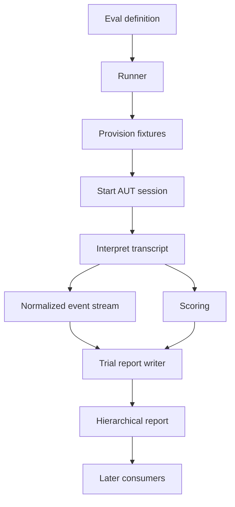

# RFD0001 - Evalkit Core, Execution, and Reporting

- Feature Name: `core-execution-reporting`
- Status: Draft
- Author: `leostera`
- Start Date: `2026-09-21`
- Updated: `2026-09-21`
- Discussion PR: `TBD`
- Tracking Issue: `TBD`

## Summary

This RFD proposes the initial architecture and public mental model for Evalkit: evaluations are declarative values built with `defineEval`, an Agent Under Test (AUT) is accessed through a session-based adapter, a runner interprets the evaluation and records normalized events, and a hierarchical report store persists the complete trajectory and scoring results. The first vertical slice will execute a single in-process evaluation against an eval-author-defined test agent, apply deterministic scoring, and write an incrementally durable local report. The same contracts should later support local, remote, and isolated AUT implementations as well as conversational, trajectory, and artifact-oriented evaluations without changing the core execution model.

## Motivation

Agent evaluations need more than a function that returns pass or fail. A useful framework must describe the scenario, interact with an agent, observe what happened, score both behavior and outputs, and retain enough evidence to inspect or aggregate the result later.

The initial Evalkit scaffold exposes an `AgentSUT` with a `chat` method and models evaluations as cases with one `grade` callback. That shape is too narrow for the intended uses:

- An agent may run locally, remotely, in an isolated runtime, or as a test double defined by an Evalkit user or test.
- A scenario may contain multiple user turns and expectations about intermediate agent behavior.
- Tool calls and other agent events must be observable while execution is in progress.
- Some evaluations score the transcript, while others score files or other artifacts created by the agent.
- Failed or timed-out runs must retain their partial trajectory.
- Large runs cannot be represented efficiently as one ever-growing in-memory JSON document.

Evalkit therefore needs stable boundaries between definition, execution, observation, scoring, and persistence before transport-specific adapters or artifact runtimes are built.

## Goals

- Define evaluations as typed, composable TypeScript values.
- Establish a transport-agnostic AUT session protocol with start, send, event delivery, and close operations.
- Support single-turn and multi-turn conversational trajectories.
- Allow scoring to inspect normalized trajectories and, eventually, artifact workspaces.
- Persist events incrementally so failures still produce useful evidence.
- Store reports as a hierarchical collection of small manifests, append-only event streams, scores, and artifact files.
- Keep the in-process runner independent from local, remote, test-double, or isolated AUT implementations.
- Provide a small first vertical slice that validates the contracts before adding distributed execution.

## Non-goals

- Specifying a production remote transport or protocol.
- Implementing an isolated artifact workspace in the first vertical slice.
- Supporting multiple AUTs in one evaluation.
- Defining leaderboard, experiment comparison, or visualization products.
- Standardizing model-provider configuration, tool implementations, or agent internals.
- Finalizing every transcript shorthand or fixture source supported by future versions.
- Defining a hosted control plane or distributed scheduler.

## Guide-level explanation

An Evalkit evaluation is a declarative scenario:

```ts
const greeting = defineEval({
  id: 'greeting',
  agent: defineAgent({
    async start({ onEvent }) {
      return {
        async send(message) {
          await onEvent({
            kind: 'message',
            role: 'assistant',
            content: `Hello back, ${message}!`,
            timestamp: new Date().toISOString(),
          });
        },
        async close() {},
      };
    },
  }),
  fixtures: [],
  transcript: [user('Hello')],
  scoring: [
    predicate('responded', ({ trajectory }) => {
      return trajectory.events.some(
        (event) => event.kind === 'message' && event.role === 'assistant',
      )
        ? 1
        : 0;
    }),
  ],
});
```

`defineEval` validates and preserves the description; it does not execute it. A runner executes the value:

```ts
const result = await runEval(greeting, {
  report: localReportStore('.evalkit/runs'),
});
```

During execution, the runner:

1. creates a run and trial context;
2. provisions configured fixtures;
3. starts the AUT and registers an event callback;
4. interprets transcript steps in order;
5. appends normalized AUT and lifecycle events to the report as they occur;
6. runs each scoring rule against the resulting trajectory and artifacts;
7. writes scoring and summary data;
8. closes the AUT and finalizes the trial and run.

The AUT adapter hides where and how the agent runs. The same evaluation may use an eval-author-defined test double during framework tests and a remote implementation elsewhere, provided both implementations satisfy the AUT contract and emit the same normalized event vocabulary.

### Transcript shorthands

The intended authored vocabulary begins with three shorthands:

```ts
transcript: [
  user('Draft a response to the customer.'),
  agent({ contains: ['next steps'] }),
  judge('The response is accurate, direct, and empathetic.'),
];
```

`user(...)` sends a user message. `agent(...)` and `judge(...)` describe expectations at points in the trajectory. Their complete matching and inline-scoring semantics remain unresolved; the first vertical slice only requires `user(...)`.

### Fixtures and artifacts

Fixtures establish resources before the AUT starts. A flat declaration carries explicit visibility and a destination relative to its selected trial workspace:

```ts
fixtures: [
  directory('./fixtures/starter', {
    dst: 'workspace',
    visibility: 'candidate',
  }),
  file('./fixtures/hidden-tests.ts', {
    dst: 'tests/hidden.test.ts',
    visibility: 'evaluator',
  }),
  inlineFile('workspace/notes.txt', 'Initial notes', 'candidate'),
  dynamic(async (ctx) =>
    inlineFile(
      'workspace/run.json',
      JSON.stringify({ runId: ctx.runId }),
      'candidate',
    ),
  ),
];
```

Candidate-visible resources are available to the AUT, while evaluator-only resources are available only to scoring code. Fixture destinations must be non-empty relative paths and cannot escape their selected workspace. The initial local implementation uses separate candidate and evaluator directory trees; it is an API-level isolation boundary, not a sandbox against malicious local code.

### Scoring

Scoring rules return a value in the inclusive range `0..1` and may attach explanations and evidence:

```ts
scoring: [
  {
    kind: 'judge',
    name: 'response-quality',
    target: 'transcript',
    rubric: 'The response is accurate and concise.',
  },
  {
    kind: 'predicate',
    name: 'created-output',
    run: async ({ artifacts }) => {
      const output = await readFile(
        join(artifacts.candidate.root, 'workspace/output.txt'),
        'utf8',
      );
      return {
        value: output.length > 0 ? 1 : 0,
        explanation: 'The agent should create the requested output file.',
      };
    },
  },
];
```

A predicate may return a number as shorthand or a detailed score result. Scorer failures are recorded separately from low scores. The overall aggregation policy must be explicit rather than inferred from report consumers.

### Reports

A report is a logical result spread across a durable tree, not one large JSON document:

```text
.evalkit/runs/<run-id>/
├── manifest.json
├── summary.json
└── trials/
    └── <trial-id>/
        ├── manifest.json
        ├── trajectory.jsonl
        ├── scoring.json
        ├── artifacts/
        └── logs/
```

`trajectory.jsonl` is append-only. If execution crashes after several events, those events remain readable. Every completed fixture-backed trial automatically snapshots its entire candidate workspace beneath `artifacts/candidate/` before cleanup. Evaluator-only workspace files are excluded by default. Small metadata and aggregate files remain ordinary JSON so consumers can inspect a run without loading every trajectory or artifact.

### Diagram



## Reference-level explanation

### Architecture and boundaries

The proposal defines four conceptual layers. They may initially share a monorepo and need not each become a published package immediately.

#### Core

The core owns serializable and declarative values:

- `EvalDefinition`
- transcript step values and shorthands
- fixture descriptions
- scoring descriptions and results
- `AutAdapter`, `AutSession`, and normalized `AutEvent` contracts
- run, trial, and report metadata types

Core does not start agents, access the filesystem, or choose a persistence backend.

#### Runner

The runner interprets an `EvalDefinition`. It owns:

- run and trial identifiers;
- outer timeouts and cancellation;
- fixture lifecycle ordering;
- AUT session lifecycle;
- transcript step execution;
- normalized lifecycle events;
- scorer invocation and aggregation;
- failure conversion into reportable values;
- report writer lifecycle.

The runner must not depend on a concrete AUT transport or report backend.

#### Adapters

An AUT adapter translates a concrete agent implementation into the common session and event contracts. An adapter may be local, remote, test-double, process-backed, or isolated. Transport details and implementation-specific events remain adapter concerns until normalized.

#### Report stores

A report store persists runs without changing execution semantics. The first implementation writes local files. Future stores may store the same logical tree in a versioned file store or send it to a service.

### Data model and interfaces

The following interfaces are illustrative contracts for review. Exact generic parameters and naming may change during implementation, but their responsibilities are part of this proposal.

#### Evaluation definition

```ts
interface EvalDefinition<TAgent extends AutAdapter = AutAdapter> {
  id: string;
  name?: string;
  agent: TAgent;
  fixtures?: Fixture[];
  transcript: TranscriptStep[];
  scoring: ScoringRule[];
  policy?: EvalPolicy;
  metadata?: JsonObject;
}

function defineEval<const T extends EvalDefinition>(definition: T): T;
```

Version one supports exactly one `agent` per evaluation. Running one scenario against multiple agents is deferred.

#### AUT protocol

```ts
interface AutAdapter<TMessage = string> {
  readonly identity?: AutIdentity;

  start(options: {
    context: AutContext;
    onEvent: (event: AutEvent) => void | Promise<void>;
  }): Promise<AutSession<TMessage>>;
}

interface AutSession<TMessage = string> {
  send(message: TMessage): Promise<void>;
  close(): Promise<void>;
}
```

The event callback is installed as part of `start`, before the adapter may emit startup events. For the initial contract, `send` accepts a string and resolves when the corresponding agent turn has completed. Events may be delivered while `send` is pending.

`defineAgent` is a type-preserving helper for authoring adapters, including user-owned test doubles. Evalkit does not ship a fake AUT:

```ts
function defineAgent<const T extends AutAdapter>(agent: T): T;
```

Adapters must serialize concurrent callback delivery or document that the runner serializes it before persistence. Event order within one session must be stable.

#### Normalized events

The initial vocabulary should include lifecycle, message, tool, completion, and failure information:

```ts
type AutEvent =
  | { kind: 'started'; timestamp: string }
  | {
      kind: 'message';
      role: 'system' | 'user' | 'assistant' | 'tool';
      content: JsonValue;
      timestamp: string;
    }
  | {
      kind: 'tool-call';
      id: string;
      name: string;
      arguments: JsonValue;
      timestamp: string;
    }
  | {
      kind: 'tool-result';
      id: string;
      name?: string;
      result: JsonValue;
      timestamp: string;
    }
  | { kind: 'turn-started'; turn: number; timestamp: string }
  | {
      kind: 'turn-completed';
      turn: number;
      timestamp: string;
      latencyMs?: number;
      usage?: Usage;
    }
  | { kind: 'completed'; output?: JsonValue; timestamp: string }
  | { kind: 'error'; error: RecordedError; timestamp: string };
```

Events emitted by the runner, such as transcript step boundaries and grader lifecycle events, should use the same persisted trajectory stream but remain distinguishable from AUT-originated events. Whether this is represented by a `source` field or a broader `TrajectoryEvent` union is an implementation-time question.

#### Scoring

```ts
interface ScoreResult {
  name: string;
  kind: 'predicate' | 'judge';
  value?: number;
  passed?: boolean;
  explanation?: string;
  evidence?: JsonValue;
  durationMs: number;
  error?: RecordedError;
}
```

Scores must either contain a finite `value` in `0..1` or an `error`. A scorer execution error must never silently become a score of zero. Consumers may choose to treat scorer errors as failed evaluations, but the persisted distinction must remain available.

Judge scorers identify a target such as `transcript` or `artifacts`. Predicate scorers receive a trial-scoped context, a read-only trajectory view, and capabilities appropriate to the configured artifact visibility.

#### Reporting protocol

```ts
interface ReportStore {
  startRun(metadata: RunMetadata): Promise<RunWriter>;
}

interface RunWriter {
  startTrial(metadata: TrialMetadata): Promise<TrialWriter>;
  finalize(summary: RunSummary): Promise<void>;
}

interface TrialWriter {
  appendEvent(event: TrajectoryEvent): Promise<void>;
  writeScores(scoring: TrialScoring): Promise<void>;
  writeArtifact(path: string, data: Uint8Array): Promise<void>;
  finalize(summary: TrialSummary): Promise<void>;
}
```

The API must also define failure-safe finalization or abort operations. Writers should be idempotent where practical, and all persisted paths must be relative to the run root.

The runner returns a compact `RunResult` containing identity, status, summaries, and report location. It does not need to return every event or artifact in memory.

### Lifecycle and failure semantics

The required trial order is:

1. Allocate run and trial identities.
2. Open the report writer and persist running manifests.
3. Provision fixtures and trial resources.
4. Start the AUT with the registered event callback.
5. Execute transcript steps in order.
6. Close or stop the AUT.
7. Run scoring while artifact resources remain available.
8. Capture configured artifacts.
9. Finalize trial scoring and summary.
10. Clean up ephemeral trial resources.
11. Finalize the run summary.

Artifact workspaces must exist before the AUT starts and remain available until scoring and capture complete.

Every observed event should be appended before the runner proceeds when durability is required. An implementation may batch writes for performance, but it must define the maximum amount of buffered data that can be lost.

The runner owns an outer wall-clock timeout even if the AUT enforces an internal timeout. Timeout, cancellation, adapter failure, scorer failure, and report-store failure are distinct statuses or recorded errors.

If execution fails:

- already-written trajectory events remain valid;
- the runner attempts to record an error event and failed trial manifest;
- scoring may run against a partial trajectory only when the scorer explicitly supports partial input;
- the runner attempts to close the AUT and clean up resources;
- cleanup failure is recorded without replacing the primary failure;
- the run result points to the partial report.

If report persistence fails, execution should stop by default because an unrecorded evaluation is not a trustworthy evaluation. A future policy may permit best-effort reporting, but it must be explicit.

### Invariants

- An evaluation contains exactly one AUT in the initial version.
- `defineEval` creates a description and performs no execution or I/O.
- The AUT event callback is registered before the AUT emits observable startup activity.
- Events from one session have a deterministic persisted order.
- All persisted report values are JSON-serializable, except artifact bytes stored as files.
- Score values are finite numbers in the inclusive range `0..1`.
- Scorer errors remain distinguishable from valid low scores.
- Partial and failed runs retain all events successfully persisted before failure.
- Candidate-facing AUT capabilities cannot expose evaluator-only resources.
- Artifact and report paths are relative and cannot escape their configured roots.
- AUT adapters never receive report-store credentials unless separately and explicitly configured.
- Report consumers can inspect manifests and summaries without loading full trajectories or artifacts.
- The execution pipeline for conversational and artifact-oriented evaluations is shared rather than duplicated.

### Compatibility and migration

Evalkit has not published a stable API, so this proposal does not require backward compatibility. The current `AgentSUT`, `EvalConfig`, case-based `EvalDefinition`, and single `grade` callback in `packages/core/src/index.ts` should be considered provisional and replaced incrementally by the AUT, transcript, scoring, and reporting contracts in this RFD.

Report schemas must carry explicit versions from their first implementation. Additive changes may retain a schema version when consumers can ignore unknown fields. Changes to interpretation, required fields, or file layout require a version change and migration guidance.

### Security, privacy, and observability

Trajectories and artifacts may contain prompts, model output, tool arguments, source code, filesystem contents, credentials accidentally echoed by tools, or other sensitive data. Local persistence must therefore be treated as potentially sensitive output.

The initial implementation should:

- keep `.evalkit/` ignored by default;
- avoid persisting environment variables or credentials in metadata;
- store only relative report and artifact paths;
- apply output-size limits to events and scorer evidence;
- clearly distinguish raw reports from any future sanitized or published projection;
- make redaction an explicit runner or report-store policy rather than claiming reports are secret-free by construction.

The trajectory itself is the primary execution log. Runner lifecycle and grader events should be recorded there instead of relying exclusively on process logs. Implementations may also expose live human-readable or machine-readable progress from the same event source.

### Rollout and validation

Implementation should proceed as a narrow vertical slice:

1. Replace provisional core types with `EvalDefinition`, transcript `user(...)`, AUT, event, predicate, and result types.
2. Validate the runner with an eval-author-defined test agent.
3. Implement `runEval` for one trial and one or more user steps.
4. Implement deterministic predicates and score normalization.
5. Implement a local hierarchical report store with append-only `trajectory.jsonl`.
6. Add failure-path tests proving partial reports survive adapter and scorer errors.
7. Add artifact fixtures and workspace capabilities only after the core slice is stable.
8. Add concrete local, remote, or isolated AUT adapters independently of the core runner.

Acceptance criteria for the first slice:

- An eval author can define and run a one-turn evaluation against an eval-author-defined test agent.
- An eval-author-defined test agent can emit assistant and tool events through the callback.
- A predicate can score the recorded trajectory.
- The runner returns a compact result with the report path.
- The local report store writes run and trial manifests, `trajectory.jsonl`, scoring, and summaries.
- A forced AUT failure leaves a readable partial trajectory and failed manifest.
- Tests verify event ordering, score range validation, cleanup, and path containment.

## Drawbacks

- A session protocol, normalized event vocabulary, runner, and hierarchical persistence API introduce more concepts than a simple `chat` function and grade callback.
- Normalization may discard transport-specific detail unless adapters can attach bounded metadata or artifacts.
- Incremental persistence adds I/O overhead and makes report-store failure part of execution semantics.
- Separating definitions, execution, adapters, and stores creates more package and ownership boundaries to maintain.
- Deferring complete fixture and transcript semantics means the first API is intentionally incomplete.

## Rationale and alternatives

### Proposed design

The proposal isolates the most stable concepts: declarative scenarios, session-based interaction, normalized observations, scoring, and durable reporting. It allows different agent implementations and execution locations to share one evaluation and reporting pipeline. Hierarchical incremental reports scale beyond small examples and preserve evidence when a run fails.

Starting with an eval-author-defined test agent keeps the first implementation focused on contract correctness. More complex runtimes can be added after event ordering, lifecycle, failure, and report semantics are tested.

### Simpler or narrower approach

Evalkit could expose only:

```ts
runEval(async () => {
  const output = await agent.chat('hello');
  return output === 'hello back';
});
```

This would be quicker to implement but would make tool events, multi-turn scenarios, artifact evaluation, partial failure reports, and alternate transports ad hoc concerns. Each serious consumer would build a separate trajectory and persistence layer, defeating the purpose of a shared library.

### Other alternatives considered

- **Async iterable instead of callback:** An AUT could return `AsyncIterable<AutEvent>`. This models streaming naturally, but sending multiple messages while consuming one stream requires a bidirectional session anyway. A callback registered during `start` keeps observation active across all `send` calls. An async-iterable facade may be added later.
- **One-shot `run(prompt)` adapter:** This is convenient for single-prompt evaluations but does not naturally support multi-turn trajectories or steering. It can be implemented as an adapter over the session protocol.
- **One large `report.json`:** This is simple to read for small runs but requires rewriting or retaining the full trajectory in memory, performs poorly for large artifacts, and loses useful incremental durability.
- **Transport-specific runner APIs:** Separate local and remote runners could expose each environment directly, but evaluation definitions would become tied to execution location and report behavior would diverge.
- **Separate chat and artifact pipelines:** Dedicated pipelines could optimize each use case, but hybrid evaluations would duplicate lifecycle, scoring, error, and persistence semantics.

### Do nothing

Keeping the current case-and-grade scaffold would permit basic response tests but leave multi-turn interaction, tool traces, artifact workspaces, partial reports, and scalable persistence undefined. Adding concrete adapters before these boundaries exist would likely bake transport-specific assumptions into the public API.

## Prior art

The primary inspiration is the sibling Rust evaluation library under [`../agents/crates/evals`](../../../agents/crates/evals). It separates evaluation descriptions, trajectories, graders, trial records, fixtures, candidate/evaluator workspaces, and reporting. Particularly relevant lessons are:

- typed runtime values should only erase to JSON at the persistence boundary;
- trajectory step and grader lifecycle events are part of the report, not incidental logs;
- artifact workspaces must exist before agent construction and remain available through grading and capture;
- candidate capabilities must not expose evaluator-only material;
- external agent implementations should normalize into the same trial and report pipeline as native agents;
- outer timeouts and failure conversion belong to the runner rather than individual adapters;
- trial identifiers should connect terminal output, trajectories, artifacts, and summaries.

Evalkit adapts those lessons to a TypeScript value-oriented API and a callback-driven AUT session. It does not attempt to reproduce Rust macros, static agent types, or the existing command harness.

Append-only event logs and event-sourced systems also inform the report design: immutable observations are written first, while summaries and projections can be rebuilt or consumed independently. Evalkit does not propose general event sourcing; it applies the append-only property only to trial trajectories.

## Unresolved questions

### Before acceptance

- Should normalized events use one `TrajectoryEvent` union with a `source` field, or separate AUT and runner event variants?
- What exactly does `agent(...)` mean in an authored transcript: an expectation on the next response, a supplied assistant message, or both through distinct forms?
- Is `judge(...)` exclusively a scoring rule, or may it appear inline as a trajectory checkpoint?
- Should future fixture sources include repositories and binary content, and what revision and size policies should they use?
- What is the default overall-score and pass/fail aggregation policy across multiple scoring rules?
- Should report-store persistence be strictly required, or may callers explicitly choose an in-memory or best-effort mode?

### During implementation

- The exact generic parameters of `AutAdapter`, `AutSession`, and `EvalDefinition`.
- Whether timestamps are supplied by adapters or assigned by the runner at receipt time.
- The batching and flush policy for `trajectory.jsonl`.
- The exact manifest and summary schemas and file naming.
- How run and trial IDs are generated and made reproducible in tests.
- Whether `close` needs a reason, deadline, or separate cancellation method in the first version.
- How bounded adapter-specific metadata can survive normalization.

### Out of scope

- Running one evaluation against several AUTs and computing comparative scores.
- Distributed scheduling, retries across machines, and hosted orchestration.
- Versioned remote artifact storage.
- Public report sanitization and publication workflows.
- Leaderboard schemas and cross-run ranking policy.
- Provider-specific cost calculation.

## Future possibilities

The contracts may later support multiple trials, comparative AUT runs, weighted scoring, model judges, artifact snapshots, replay, remote and isolated execution, live progress UIs, report indexing, cross-run regression analysis, and versioned report storage. These extensions should consume the same normalized trajectory and hierarchical report rather than create parallel execution paths.
